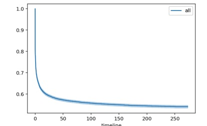
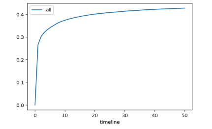
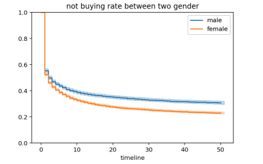
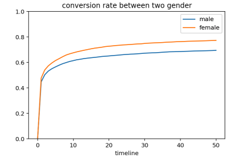
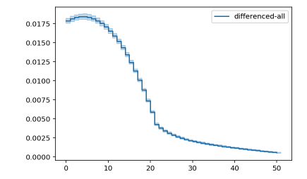
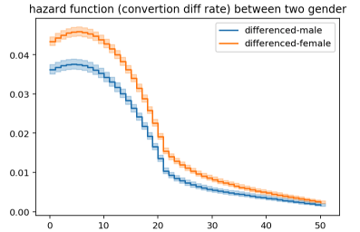
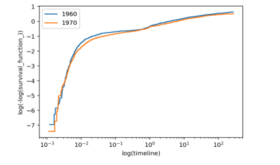
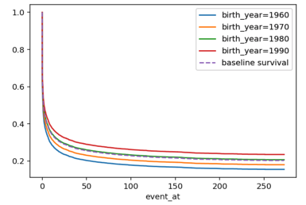
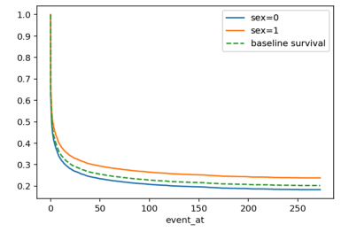

# 新用户行为与生存分析

## 生存分析的来历

生存分析（Survival Analysis）来源于基础医学领域，最早用来研究各种治疗方案对病人寿命的影响。而寿命则用一个**end event**（死亡）的方式衡量。基本定义如下：

T为标记事件发生的时间。

* **生存函数**（Survival Function）。用来描述**未发生end event的样本的比例随时间变化的趋势**。

  $$S(t) = P(T > t)$$

* **Hazard函数**(Hazard Function)。描述**end event发生的概率变化率**。

  $$\lambda (t)  = {lim}_{h\to 0} \frac{P(t \le T < t + h | T \ge t)}{h}$$

* 两个函数之间的关系:

  $$S(t) = e^{-\int_{0}^t \lambda (s)ds}$$

## 生存分析与新用户行为

然而，生存分析的定义本身让它和很多用户行为事件本身发生联系。譬如，用户流失和生存分析研究的概念完全一致，而常见的流失分析，可能会存在以下问题：

1. 无法提供每一个时刻流失发生的概率
2. 很难具有预测性
3. 多个产品/A-B testing时很难互相做出定量比较。

而生存分析本身就会对以上三个内容做出预测，此外，对**Customer Lifetime Value**能提出一些更有价值的洞识。

但本文试图扩展生存分析的试用范围，任何具有触发时间特征的事件，都可以采用生存分析的方式做出分析，譬如：

1. 用户留存
2. 用户转化
3. 用户点击
4. ...

本文以常见的**购买行为**的转化为例，介绍生存分析的某些应用。

## 用户转化

### 前期构思

本实例是研究，用户从注册时开始，随时间变化其转化率会有何种变化，考虑届时提供一些运营策略。常规计算本任务转化率的方式是：

转化率 = # 转化用户数 / # 总用户数数

这个转化率往往很难提供更多的洞识，我们无法给出自动化运营可以介入的时间要素。而生存分析从本质上说，恰恰是研究一个**发生事件**的概率随时间发生的变化，在此项任务中，**事件**显然就是**转化**。基于这种思想，我们做出如下分析。

### 数据样例

生存分析需要以一个用户为单位，提取**参与实验的时间**(这里就是注册时间)，**终止实验/end event发生时间**(这里就是指数据采集的截止日期和用户发生转化的时间)，以及最后是否发生end event的标记。

因此我们采集了如下数据。其中`sex`，`birth_year`，`province`三个字段用以后面的分析，`duration`则是到事件发生时总共花费的时间，即`test_last_time - signup_time`。

|    |   user_id | signup_time                | end_time                   | test_last_time      | buy_time                   | sex   |   birth_year | province   | have_bought   |     duration |
|---:|----------:|:---------------------------|:---------------------------|:--------------------|:---------------------------|:------|-------------:|:-----------|:--------------|-------------:|
|  0 |    513336 | 2017-10-30 21:58:04.323000 | 2017-10-30 22:03:54.430000 | 2018-06-01 00:00:00 | 2017-10-30 22:03:54.430000 | 女    |         1991 | 山东       | True          |   0.00405216 |
|  1 |    513340 | 2017-10-30 22:14:35.853000 | 2017-10-30 22:45:10.243000 | 2018-06-01 00:00:00 | 2017-10-30 22:45:10.243000 | 男    |         1988 | 安徽       | True          |   0.0212314  |
|  2 |    513353 | 2017-10-31 07:29:04.293000 | 2018-06-01 00:00:00        | 2018-06-01 00:00:00 | NaT                        | nan   |          nan | nan        | False         | 212.688      |
|  3 |    513370 | 2017-10-31 10:45:45.586000 | 2018-06-01 00:00:00        | 2018-06-01 00:00:00 | NaT                        | 女    |         1979 | 河南       | False         | 212.552      |
|  4 |    513387 | 2017-10-31 13:00:32.360000 | 2017-10-31 13:09:38.100000 | 2018-06-01 00:00:00 | 2017-10-31 13:09:38.100000 | 女    |         1992 | 山东       | True          |   0.00631644 |

### 分析转化率随注册后时间发生的变化

`Python`比较完整的支持生存分析的包是[`Liflines`](https://lifelines.readthedocs.io/en/latest/)和[`scikit-survival`](https://github.com/sebp/scikit-survival)。两者之间，对分析友好的方案是前者，我们在本博文中，也主要采用该模块进行分析。

```python
from lifelines import NelsonAalenFitter, CoxPHFitter, KaplanMeierFitter
from lifelines.statistics import logrank_test
```

首先，我们需要查看用户的**未转化率**（有点绕口），这直接可以用生存分析本身的定义来实现。

```python
kmf = KaplanMeierFitter()
kmf.fit(df['duration'], event_observed=df['have_bought'], label='all')
kmf.plot()
```




显然，我们可以发现，在50天后，基本上变化不明显了，最初的50天内，用40%多的用户发生转化。当然，这一图示并不直观，我们可以用`1 - 未转化率=转化率`的方式来重新绘制**转化率曲线**。

```python
(1 - kmf.survival_function_).plot()
```




显然，这张图已经可以参与到运营决策中取了，图中显示，用户会在前10天内转化，后期变化不在明显。但我们可以通过生存分析得到更多有意思的结论。

一个例子就是分析不同产品的生存曲线图来分析产品之间的好坏（在此不做示范），一个就是用户本身特征对转化的影响。在此，我们以性别为例，分析性别对用户更早决定购买产品/转化之间有何有何关系。

```python
ax = subplot(111)

t = np.linspace(0, 50, 51)
kmf.fit(df[df['sex'] == '男']['duration'], event_observed=df[df['sex'] == '男']['have_bought'], timeline=t, label="male")
ax = kmf.plot(ax=ax)

kmf.fit(df[df['sex'] == '女']['duration'], event_observed=df[df['sex'] == '女']['have_bought'], timeline=t, label="female")
ax = kmf.plot(ax=ax)

plt.ylim(0,1)
plt.title("not buying rate between two gender");
```




```python
ax = subplot(111)

t = np.linspace(0, 50, 51)
kmf.fit(df[df['sex'] == '男']['duration'], event_observed=df[df['sex'] == '男']['have_bought'], timeline=t, label="male")
ax = (1 - kmf.survival_function_).plot(ax=ax)

kmf.fit(df[df['sex'] == '女']['duration'], event_observed=df[df['sex'] == '女']['have_bought'], timeline=t, label="female")
ax = (1 - kmf.survival_function_).plot(ax=ax)

plt.ylim(0,1)
plt.title("conversion rate between two gender");
```



显然，我们从图中可以发现，女性更倾向于更快相信此产品，更早时间并且更多比例的发现转化。接下来，我们可以利用自带的`log-rank test`对两者是否差异显著做预测。

```python
logrank_test(event_times_A=df[df['sex']=='男']['duration'], event_observed_A=df[df['sex']=='男']['duration'],
            event_times_B=df[df['sex']=='女']['duration'], event_observed_B=df[df['sex']=='女']['duration'])
```

```
<lifelines.StatisticalResult: 

t_0=-1, alpha=0.95, null_distribution=chi squared, df=1

test_statistic      p     
       82.2898 0.0000  ***
---
Signif. codes:  0 '***' 0.001 '**' 0.01 '*' 0.05 '.' 0.1 ' ' 1 
>
```

显然，差异是显著的。

###分析转化率的变化率

在此，我们使用`Nelson Aslen`方法分析转化率的变化率随时间的变化（即Hazard函数）。

```python
naf = NelsonAalenFitter()
naf.fit(df['duration'], event_observed=df['have_bought'], timeline=t, label='all')
naf.plot_hazard(bandwidth=20)
```



图中可以看出，转化率的变化在前5天内略微提高，随后断崖式减少，大概在20天左右区域和缓。换用运营的术语，前五天内用户对产品的信任度略微增加，使得更有可能购买产品；但超过五天还没有购买意愿的人，购买发生的可能性随时间递减。

一个可能的运营策略就是在第5天做出一些行为，增加用户的购买意愿，从而达到提高用户的生命周期的总价值。

当然，我们如同上面板块一样，也不叫一下性别差异。



显然，女性建立信任的速度更快，但是大致都是以5天为界，在5天时没有发生购买行为，后期发生的概率会越来越小。

### 生存分析的回归分析

在此，我们还介绍一种对于不同变量对生存曲线影响的分析方法，并可以作为预测用户是否可能发生转化的模型——`Cox PH`模型。其基本假设是：

$$\lambda (t, X) = \lambda_0(t) exp(\beta X)$$

即假设待研究的变量不影响到生存模型的形状，而形状只有独立的$$\lambda_0(t)$$决定（即只和时间有关）。对此，我们需要对变量进行形状上的验证来判断该模型的有效性。在此我们只做性别和用户年龄的回归分析。

上面已经验证过性别的转化率的形状，我们使用双对数绘制对年龄（出生年）的影响。

```python
kmf0 = KaplanMeierFitter()
kmf0.fit(cph_train_df[cph_train_df['birth_year'] == 1960]['duration'], event_observed=cph_train_df[cph_train_df['birth_year'] == 1960]['have_bought'])

kmf1 = KaplanMeierFitter()
kmf1.fit(cph_train_df[cph_train_df['birth_year'] == 1970]['duration'], event_observed=cph_train_df[cph_train_df['birth_year'] == 1970]['have_bought'])

fig, axes = plt.subplots()
kmf0.plot_loglogs(ax=axes)
kmf1.plot_loglogs(ax=axes)

axes.legend(['1960', '1970'])

plt.show()
```



结果不是很符合预设，但由于演示需要，假设数据符合我们的假定，而且我们仅做线性模型。

```python
cph = CoxPHFitter()
cph.fit(cph_train_df, duration_col='duration', event_col='have_bought', show_progress=True)
cph.print_summary()
```

````
n=10000, number of events=7683

              coef  exp(coef)  se(coef)       z      p  lower 0.95  upper 0.95     
birth_year -0.0084     0.9916    0.0010 -8.7945 0.0000     -0.0103     -0.0066  ***
sex        -0.1676     0.8457    0.0241 -6.9492 0.0000     -0.2149     -0.1203  ***
---
Signif. codes:  0 '***' 0.001 '**' 0.01 '*' 0.05 '.' 0.1 ' ' 1 

Concordance = 0.528
Likelihood ratio test = 124.891 on 2 df, p=0.00000
````

我们可以发现，sex影响的项更大，参数都是显著的。之后，我们就可以用`cph`的相关函数对数据进行预测。我们在此用`plot_covariate_group`函数来展示不同属性的影响：

```python
cph.plot_covariate_groups('birth_year', [1960, 1970, 1980, 1990])
cph.plot_covariate_groups('sex', [0, 1])
```






显然，年龄越大、性别为女性越容易信任平台，更早的做出购买行为。

## 结语

这里，我们用生存分析解决并使用在用户行为分析中。给出更多可能有助于运营以及理解用户画像的洞识结论。

## References and Recommending Reading List

* [Tristan Boudreault | Survival analysis for conversion rates](https://www.youtube.com/watch?v=oui1hx2bM2o&t=2s)
* [Playtime Measurement with Survival Analysis https://arxiv.org/pdf/1701.02359](https://arxiv.org/pdf/1701.02359)
* [Using Survival Analysis to Predict Sample Retention Rates https://www.bls.gov/ore/pdf/st060060.pdf](https://www.bls.gov/ore/pdf/st060060.pdf)
* [Lifelines doc | readthedocs.io](https://lifelines.readthedocs.io/en/latest/)
* [scikit-survival | github](https://github.com/sebp/scikit-survival)

